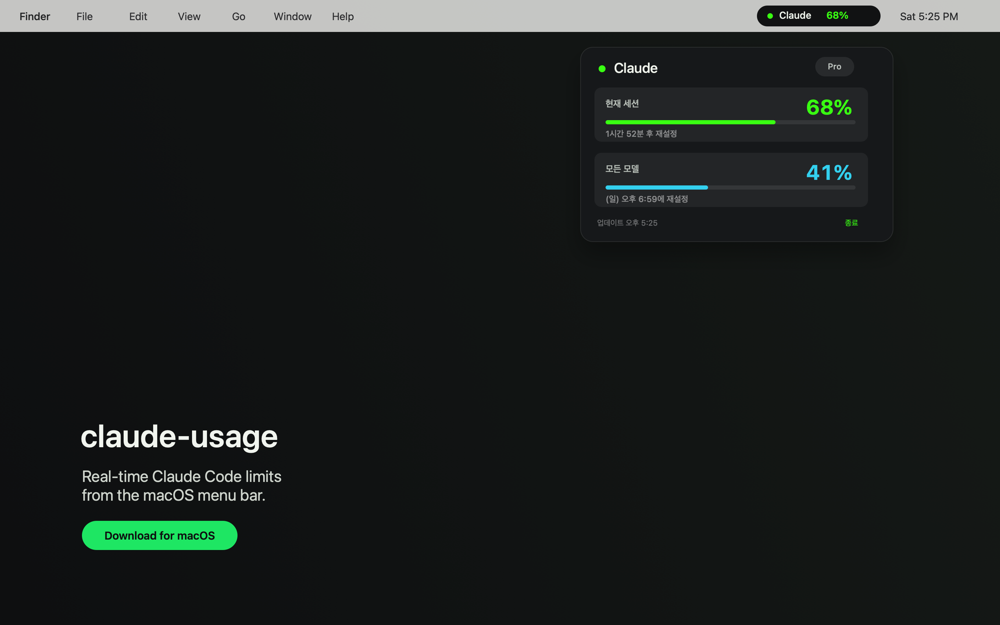

# claude-usage

A small macOS menu bar app for viewing Claude Code usage in real time.

[](https://github.com/cwLee0911/claude-usage/releases/latest/download/claude-usage.dmg)



## Download

Click the badge above to download `claude-usage.dmg`, open it, drag `claude-usage.app` to Applications, then eject the disk image.

Release DMGs are built with the packaging script so the app is Developer ID signed and packaged with an Applications shortcut.

```bash
./script/package_release.sh
```

## Features

- Shows current session and weekly Claude Code usage.
- Updates from Claude Code rate limit data in real time.
- Runs quietly in the macOS menu bar with no Dock icon.
- Preserves an existing Claude Code `statusLine.command` when one is already configured.

## Requirements

- macOS 14+
- Xcode
- `jq` recommended

## Build and Run

```bash
./script/build_and_run.sh
```

To build manually:

```bash
xcodebuild \
  -project claude-usage.xcodeproj \
  -scheme claude-usage \
  -configuration Debug \
  CODE_SIGNING_ALLOWED=NO \
  build
```

## How It Works

When the app starts, it installs a small Claude Code `statusLine` bridge script. The bridge reads Claude Code rate limit data, writes it to `~/Library/Application Support/ClaudeUsageLimits/usage.json`, and the menu bar app displays that usage in a compact panel.

## Resources

- [Build script](script/build_and_run.sh)
- [Status line bridge installer](claude-usage/Services/ClaudeStatusLineInstaller.swift)
